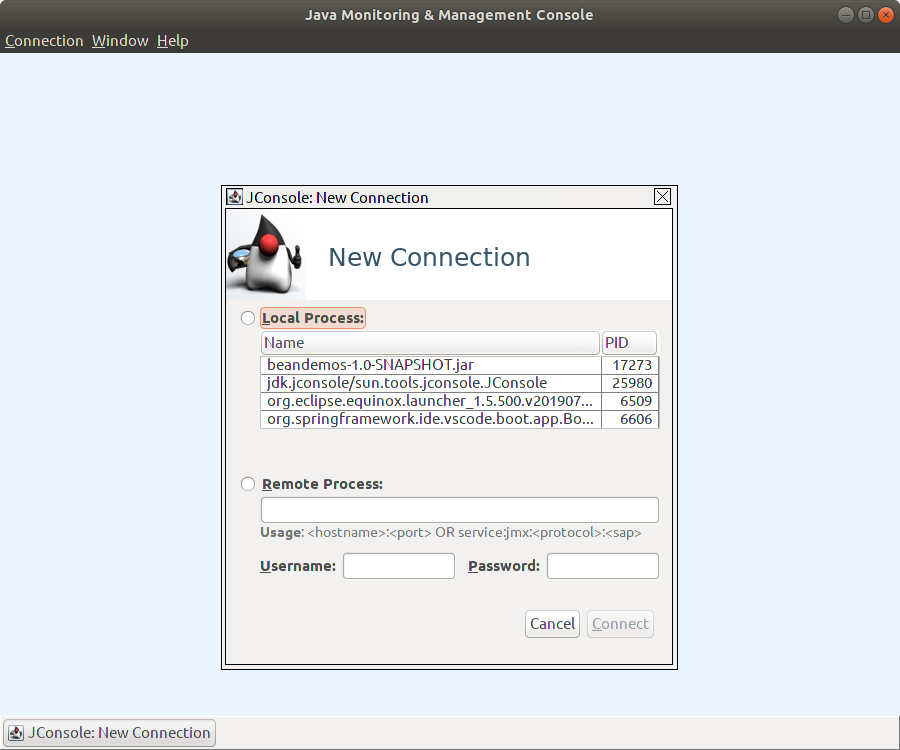
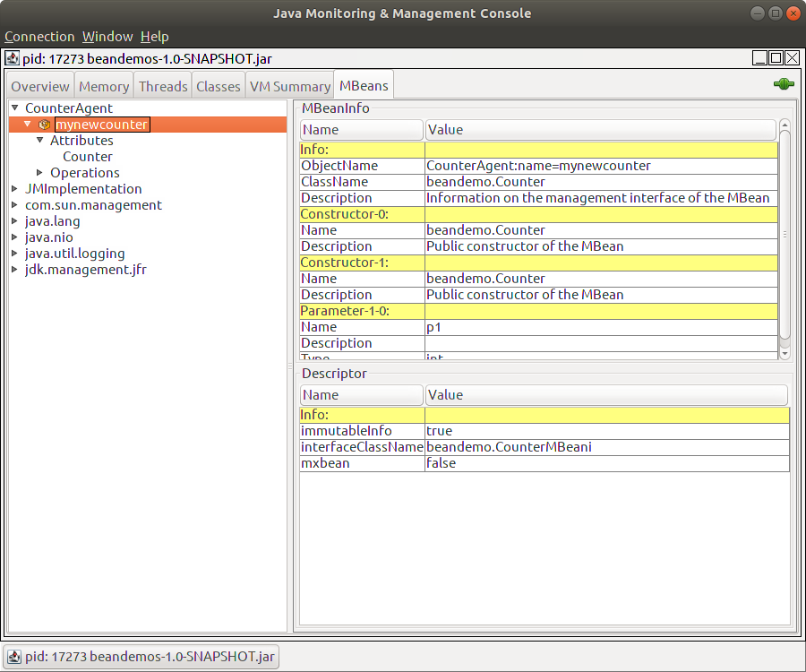
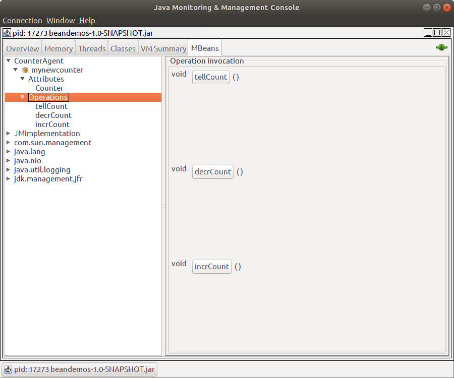
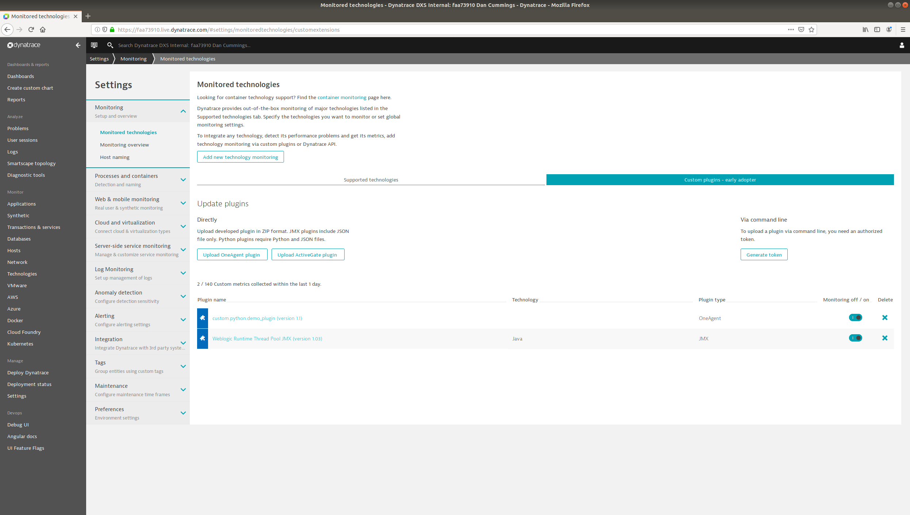

# Dynatrace JMX Example

SimpleAgent is a MBean agent which instantiates the Counter MBean to be exposed via JMX and collected by OneAgent via JMX plugin

## Requirements

* [Dynatrace Environment](https://www.dynatrace.com)
* [Dynatrace OneAgent](https://www.dynatrace.com/support/help/setup-and-configuration/dynatrace-oneagent/?_ga=2.221182296.1514778248.1564415516-750526508.1562951654)
* [Java 8 JDK & JRE](https://docs.oracle.com/javase/8/docs/technotes/guides/install/install_overview.html)
* [Maven](https://maven.apache.org/download.cgi)

## Installation

1. Use the build manager [maven](https://maven.apache.org/download.cgi) to build the JAR from the provided pom.xml.

```bash
mvn install
```
2. Move to target directory and run created JAR
```bash
cd target
java -jar beandemos-1.0-SNAPSHOT.jar
```
## Usage

With `beandemos-1.0-SNAPSHOT.jar` running via the above command; verify mBean is correctly exposed using `jconsole`

```bash
jconsole
```
Connect to the JAR process running locally



Once connected, navigate to the tab for "mBean" located at the top. This tab will contain all available domains with exposed mBeans for this process JVM. Select the `CounterAgent` as the domain and the key: name as `mynewcounter`.



If these values are available in this JConsole, the OneAgent should be able to access this via the JMX Editor.

### Note:

We can manipulate this value within the `jconsole` via the operations for this mBean. In a real environment this value is manipulated and updated based on the specific performance or business requirements in code. For our case, we will manipulate this via the operations menu.



## Define JMX Plugin
With `CounterAgent` domain exposed correctly, let's implement our JMX plugin. If you are unfamiliar with using the JMX editor there is a [sample JMX plugin definiton](plugin.json) in this project.

In your Dynatrace environment head to Settings > Monitored Technologies > Custom Plugin



## Contributing
Pull requests are welcome. For major changes, please open an issue first to discuss what you would like to change.

Please make sure to update tests as appropriate.

## License
[MIT](https://choosealicense.com/licenses/mit/)